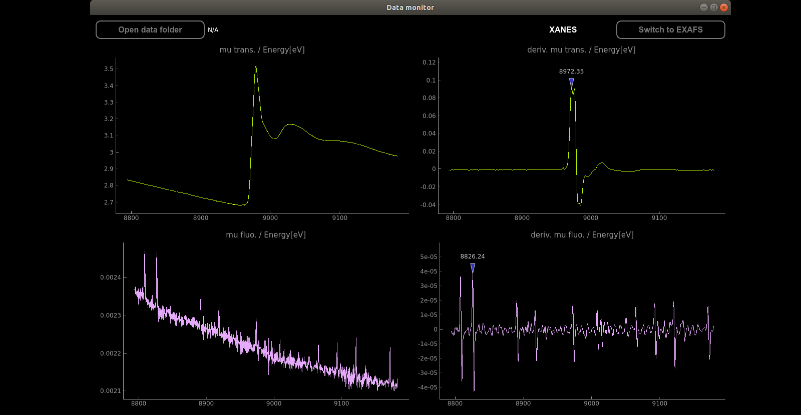

# EXAFS_Monitor

Live EXAFS data plotting ang simple analysis

Dependencies: pyqtgraph, pyzmq

  * monitor_gui_sub.py - plotting, analysis

  * monitor_data_pub.py - data sending 

  * .dat - data file examples

